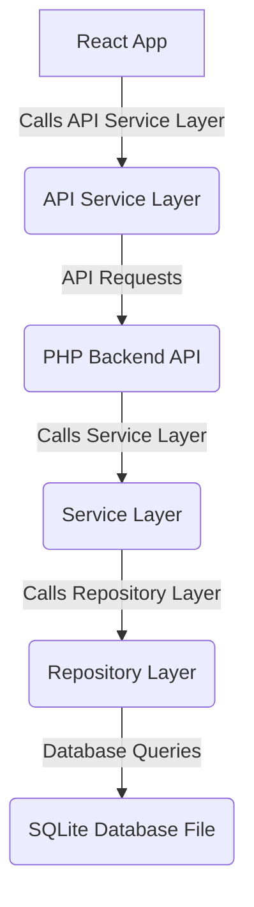

```mermaid
graph TD
    A[React App] -->|Calls API Service Layer| B(API Service Layer)
    B -->|API Requests| C(PHP Backend API)
    C -->|Calls Service Layer| D(Service Layer)
    D -->|Calls Repository Layer| E(Repository Layer)
    E -->|Database Queries| F(SQLite Database File)
```