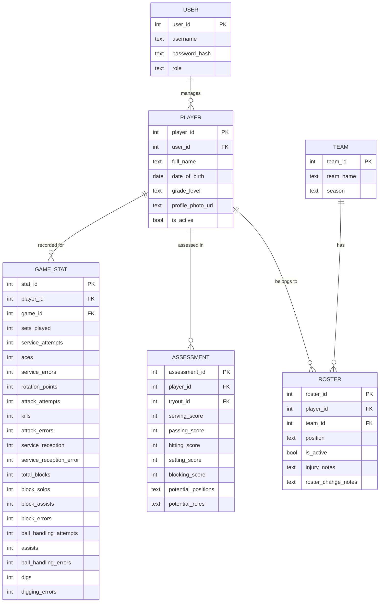

```mermaid
erDiagram
    USER {
        int user_id PK
        text username
        text password_hash
        text role
    }
    PLAYER {
        int player_id PK
        int user_id FK
        text full_name
        date date_of_birth
        text grade_level
        text profile_photo_url
        bool is_active
    }
    TEAM {
        int team_id PK
        text team_name
        text season
    }
    ROSTER {
        int roster_id PK
        int player_id FK
        int team_id FK
        text position
        bool is_active
        text injury_notes
        text roster_change_notes
    }
    ASSESSMENT {
        int assessment_id PK
        int player_id FK
        int tryout_id FK
        int serving_score
        int passing_score
        int hitting_score
        int setting_score
        int blocking_score
        text potential_positions
        text potential_roles
    }
    GAME_STAT {
        int stat_id PK
        int player_id FK
        int game_id FK
        int sets_played
        int service_attempts
        int aces
        int service_errors
        int rotation_points
        int attack_attempts
        int kills
        int attack_errors
        int service_reception
        int service_reception_error
        int total_blocks
        int block_solos
        int block_assists
        int block_errors
        int ball_handling_attempts
        int assists
        int ball_handling_errors
        int digs
        int digging_errors
    }

    USER ||--o{ PLAYER : "manages"
    PLAYER ||--o{ ROSTER : "belongs to"
    PLAYER ||--o{ ASSESSMENT : "assessed in"
    PLAYER ||--o{ GAME_STAT : "recorded for"
    TEAM ||--o{ ROSTER : "has"
```