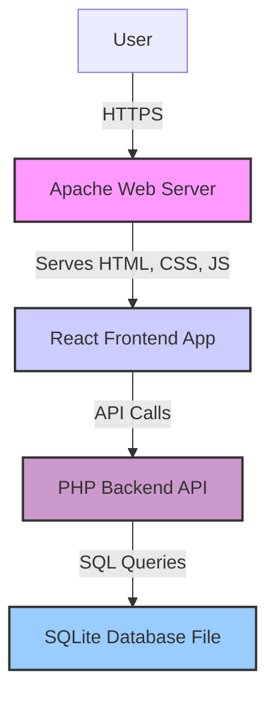

```mermaid
graph TD
    A[User] -->|HTTPS| B[Apache Web Server]
    B -->|Serves HTML, CSS, JS| C[React Frontend App]
    C -->|API Calls| D[PHP Backend API]
    D -->|SQL Queries| E[SQLite Database File]
    style B fill:#f9f,stroke:#333,stroke-width:2px
    style C fill:#ccf,stroke:#333,stroke-width:2px
    style D fill:#c9c,stroke:#333,stroke-width:2px
    style E fill:#9cf,stroke:#333,stroke-width:2px
```