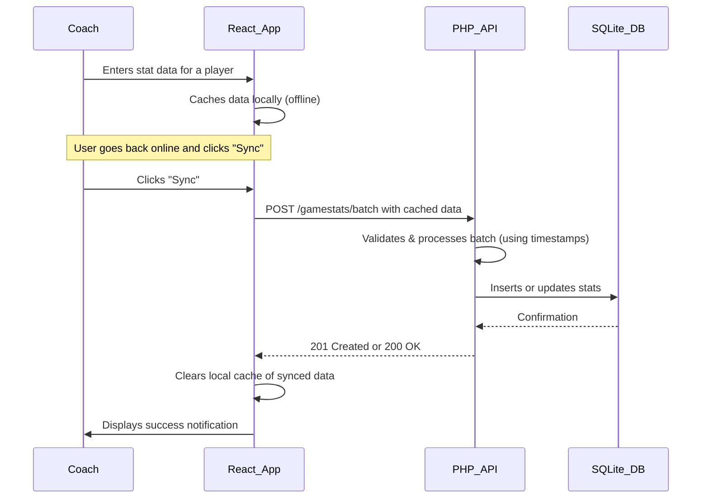

```mermaid
sequenceDiagram
    participant Coach
    participant React_App
    participant PHP_API
    participant SQLite_DB

    Coach->>React_App: Enters stat data for a player
    React_App->>React_App: Caches data locally (offline)
    Note over React_App,Coach: User goes back online and clicks "Sync"
    Coach->>React_App: Clicks "Sync"
    React_App->>PHP_API: POST /gamestats/batch with cached data
    PHP_API->>PHP_API: Validates & processes batch (using timestamps)
    PHP_API->>SQLite_DB: Inserts or updates stats
    SQLite_DB-->>PHP_API: Confirmation
    PHP_API-->>React_App: 201 Created or 200 OK
    React_App->>React_App: Clears local cache of synced data
    React_App->>Coach: Displays success notification
```