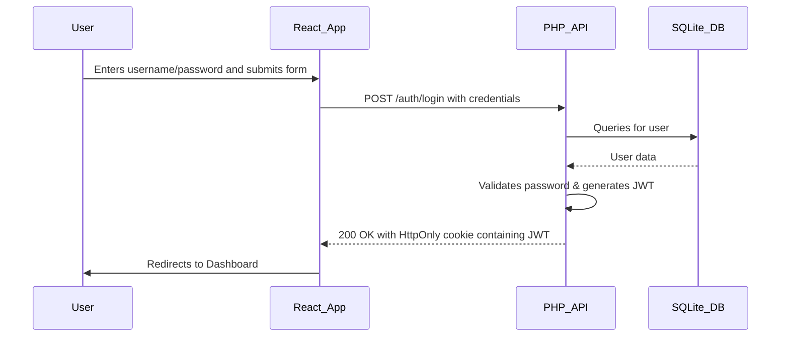

```mermaid
sequenceDiagram
    participant User
    participant React_App
    participant PHP_API
    participant SQLite_DB

    User->>React_App: Enters username/password and submits form
    React_App->>PHP_API: POST /auth/login with credentials
    PHP_API->>SQLite_DB: Queries for user
    SQLite_DB-->>PHP_API: User data
    PHP_API->>PHP_API: Validates password & generates JWT
    PHP_API-->>React_App: 200 OK with HttpOnly cookie containing JWT
    React_App->>User: Redirects to Dashboard
```