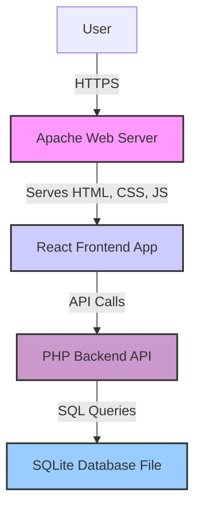
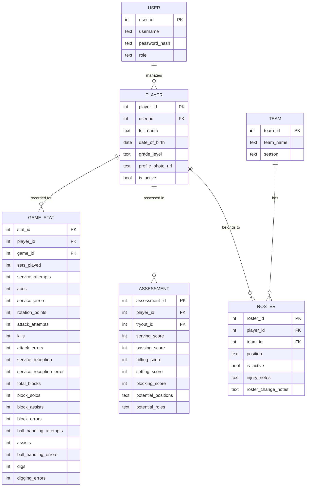

# Volleyball Coaching Application Architecture Document

## Introduction

This document outlines the complete fullstack architecture for the Volleyball Coaching Application, including the PHP backend, the React frontend, and their integration. Its primary goal is to serve as the single source of truth for development, ensuring consistency across the entire technology stack. This unified approach combines what would traditionally be separate backend and frontend architecture documents, streamlining the development process for modern fullstack applications where these concerns are increasingly intertwined.

#### Starter Template or Existing Project

This is a Greenfield project from scratch, so all tooling, bundling, and configuration will need to be set up manually.

#### Change Log

| Date | Version | Description | Author |
| :--- | :------ | :---------- | :----- |
| 2025-07-29 | 1.0 | Initial Architecture Draft | Winston (Architect) |

-----

## High Level Architecture

#### Technical Summary

The system will be built as a single, unified Monolith application, where the Apache web server serves a modern React frontend. The React application will communicate with a PHP API backend, which will handle business logic and interact with an SQLite database file. This architecture prioritizes a low-cost initial implementation while establishing a clear separation of concerns to enable future scaling and expansion.

#### Architecture Diagram



-----

## Data Models and Schema

#### Player Model

  * **Purpose**: Stores a player's core identity and profile information.
  * **Key Attributes**:
      * `player_id` (Primary Key, integer)
      * `user_id` (Foreign Key, integer): Links to the user account.
      * `full_name` (text)
      * `date_of_birth` (date)
      * `grade_level` (text)
      * `profile_photo_url` (text)
      * `is_active` (boolean)
  * **Relationships**: `one-to-one` with `User`, `one-to-many` with `Assessment`, `one-to-many` with `GameStat`.

#### Assessment Model

  * **Purpose**: Stores a coach's assessment of a player's skills, particularly during tryouts.
  * **Key Attributes**:
      * `assessment_id` (Primary Key, integer)
      * `player_id` (Foreign Key, integer): Links to the player being assessed.
      * `tryout_id` (Foreign Key, integer): Links to the tryout event.
      * `serving_score` (integer)
      * `passing_score` (integer)
      * `hitting_score` (integer)
      * `setting_score` (integer)
      * `blocking_score` (integer)
      * `potential_positions` (text): e.g., 'Setter, Hitter'.
      * `potential_roles` (text): e.g., '5-1 Setter, 6-2 Hitter'.
  * **Relationships**: `many-to-one` with `Player`, `many-to-one` with `TryoutEvent`.

#### Team Model

  * **Purpose**: Represents a team within an organization.
  * **Key Attributes**:
      * `team_id` (Primary Key, integer)
      * `organization_id` (Foreign Key, integer)
      * `team_name` (text)
      * `season` (text)
  * **Relationships**: `one-to-many` with `Roster`.

#### Roster Model

  * **Purpose**: Manages the players on a specific team for a season.
  * **Key Attributes**:
      * `roster_id` (Primary Key, integer)
      * `player_id` (Foreign Key, integer)
      * `team_id` (Foreign Key, integer)
      * `position` (text)
      * `is_active` (boolean)
      * `injury_notes` (text)
      * `roster_change_notes` (text)
  * **Relationships**: `many-to-one` with `Player`, `many-to-one` with `Team`.

#### GameStat Model

  * **Purpose**: Stores game-day statistics for a player.
  * **Key Attributes**:
      * `stat_id` (Primary Key, integer)
      * `player_id` (Foreign Key, integer)
      * `game_id` (Foreign Key, integer)
      * `sets_played` (integer)
      * `service_attempts` (integer)
      * `aces` (integer)
      * `service_errors` (integer)
      * `rotation_points` (integer)
      * `attack_attempts` (integer)
      * `kills` (integer)
      * `attack_errors` (integer)
      * `service_reception` (integer)
      * `service_reception_error` (integer)
      * `total_blocks` (integer)
      * `block_solos` (integer)
      * `block_assists` (integer)
      * `block_errors` (integer)
      * `ball_handling_attempts` (integer)
      * `assists` (integer)
      * `ball_handling_errors` (integer)
      * `digs` (integer)
      * `digging_errors` (integer)
  * **Relationships**: `many-to-one` with `Player`, `many-to-one` with `Game`.

#### Entity-Relationship Diagram



-----

## Tech Stack

This is the DEFINITIVE technology selection for the entire project. This table is the single source of truth - all development must use these exact versions.

#### Cloud Infrastructure

  * **Provider**: BlueHost
  * **Key Services**: Apache Web Server, SQLite
  * **Deployment Host and Regions**: Undefined

#### Technology Stack Table

| Category | Technology | Version | Purpose | Rationale |
| :--- | :--- | :--- | :--- | :--- |
| **Frontend Framework** | React | 18.2.0 | Frontend application UI | Industry standard, robust ecosystem, high performance, aligns with modern web practices |
| **Backend Language** | PHP | 8.3.x | Backend API for business logic | Aligns with client's hosting constraints |
| **API Style** | REST | N/A | Communication between frontend and backend | Standard, well-understood, and highly compatible with both React and PHP |
| **Database** | SQLite | 3.x | Primary data persistence | Low-cost MVP solution, file-based, easy deployment on shared hosting |

-----

## API Specification

This section defines the REST API contract for the application using OpenAPI 3.0. It is the single source of truth for all API interactions between the frontend and backend.

```yaml
openapi: 3.0.0
info:
  title: Volleyball Coaching App API
  version: 1.0.0
  description: API for managing volleyball teams, players, stats, and schedules.
servers:
  - url: /api/v1
    description: Production server
paths:
  /auth/login:
    post:
      summary: Authenticates a user and returns a token.
      requestBody:
        required: true
        content:
          application/json:
            schema:
              type: object
              properties:
                username:
                  type: string
                password:
                  type: string
      responses:
        '200':
          description: Successful authentication.
          content:
            application/json:
              schema:
                type: object
                properties:
                  token:
                    type: string
        '401':
          description: Invalid credentials.
          content:
            application/json:
              schema:
                $ref: '#/components/schemas/ApiError'

  /users:
    get:
      summary: Retrieves a list of users based on role. (Coach and Assistant Coach roles only)
      security:
        - BearerAuth: []
      parameters:
        - in: query
          name: role
          schema:
            type: string
            enum: [coach, assistant_coach, player, parent]
          description: Filter by user role.
        - in: query
          name: page
          schema:
            type: integer
          description: The page number to retrieve.
        - in: query
          name: limit
          schema:
            type: integer
          description: The number of items per page.
      responses:
        '200':
          description: A list of users.
          content:
            application/json:
              schema:
                type: array
                items:
                  $ref: '#/components/schemas/User'
    post:
      summary: Creates a new user. (Coach role only)
      security:
        - BearerAuth: []
      requestBody:
        required: true
        content:
          application/json:
            schema:
              $ref: '#/components/schemas/NewUser'
      responses:
        '201':
          description: User created successfully.
          content:
            application/json:
              schema:
                $ref: '#/components/schemas/User'
        '400':
          description: Invalid input.
          content:
            application/json:
              schema:
                $ref: '#/components/schemas/ApiError'

  /users/{id}:
    get:
      summary: Retrieves a user by ID. (Coach and Assistant Coach roles can view all; Player can view own)
      security:
        - BearerAuth: []
      parameters:
        - in: path
          name: id
          required: true
          schema:
            type: integer
          description: The user ID.
      responses:
        '200':
          description: A single user.
          content:
            application/json:
              schema:
                $ref: '#/components/schemas/User'
    put:
      summary: Updates a user by ID. (Coach and Assistant Coach roles can update their own team's users)
      security:
        - BearerAuth: []
      parameters:
        - in: path
          name: id
          required: true
          schema:
            type: integer
          description: The user ID.
      requestBody:
        required: true
        content:
          application/json:
            schema:
              $ref: '#/components/schemas/UpdateUser'
      responses:
        '200':
          description: User updated successfully.
          content:
            application/json:
              schema:
                $ref: '#/components/schemas/User'
        '403':
          description: Forbidden.
          content:
            application/json:
              schema:
                $ref: '#/components/schemas/ApiError'

  /players:
    get:
      summary: Retrieves a list of players. (Coach and Assistant Coach roles only)
      security:
        - BearerAuth: []
      parameters:
        - in: query
          name: page
          schema:
            type: integer
          description: The page number to retrieve.
        - in: query
          name: limit
          schema:
            type: integer
          description: The number of items per page.
      responses:
        '200':
          description: A list of players.
          content:
            application/json:
              schema:
                type: array
                items:
                  $ref: '#/components/schemas/Player'
    post:
      summary: Creates a new player. (Coach role only)
      security:
        - BearerAuth: []
      requestBody:
        required: true
        content:
          application/json:
            schema:
              $ref: '#/components/schemas/NewPlayer'
      responses:
        '201':
          description: Player created successfully.

  /players/{id}:
    get:
      summary: Retrieves a player by ID. (Coach and Assistant Coach roles can view all; Player can view own; Parent can view their child)
      security:
        - BearerAuth: []
      parameters:
        - in: path
          name: id
          required: true
          schema:
            type: integer
          description: The player ID.
      responses:
        '200':
          description: A single player.
          content:
            application/json:
              schema:
                $ref: '#/components/schemas/Player'
    put:
      summary: Updates a player by ID. (Coach role only)
      security:
        - BearerAuth: []
      parameters:
        - in: path
          name: id
          required: true
          schema:
            type: integer
          description: The player ID.
      requestBody:
        required: true
        content:
          application/json:
            schema:
              $ref: '#/components/schemas/UpdatePlayer'
      responses:
        '200':
          description: Player updated successfully.

  /teams:
    get:
      summary: Retrieves a list of all teams. (Coach and Assistant Coach roles can view all; Player and Parent can view their own)
      security:
        - BearerAuth: []
      parameters:
        - in: query
          name: page
          schema:
            type: integer
          description: The page number to retrieve.
        - in: query
          name: limit
          schema:
            type: integer
          description: The number of items per page.
      responses:
        '200':
          description: A list of teams.
          content:
            application/json:
              schema:
                type: array
                items:
                  $ref: '#/components/schemas/Team'
    post:
      summary: Creates a new team. (Coach role only)
      security:
        - BearerAuth: []
      requestBody:
        required: true
        content:
          application/json:
            schema:
              $ref: '#/components/schemas/Team'
      responses:
        '201':
          description: Team created successfully.

  /teams/{id}:
    get:
      summary: Retrieves a team by ID. (Coach and Assistant Coach roles can view all; Player and Parent can view their own)
      security:
        - BearerAuth: []
      parameters:
        - in: path
          name: id
          required: true
          schema:
            type: integer
          description: The team ID.
      responses:
        '200':
          description: A single team.
          content:
            application/json:
              schema:
                $ref: '#/components/schemas/Team'

  /rosters:
    get:
      summary: Retrieves a list of rosters for a team. (Coach, Assistant Coach, Player, and Parent roles for their team)
      security:
        - BearerAuth: []
      parameters:
        - in: query
          name: team_id
          required: true
          schema:
            type: integer
          description: The team ID to filter by.
        - in: query
          name: page
          schema:
            type: integer
          description: The page number to retrieve.
        - in: query
          name: limit
          schema:
            type: integer
          description: The number of items per page.
      responses:
        '200':
          description: A list of rosters.
          content:
            application/json:
              schema:
                type: array
                items:
                  $ref: '#/components/schemas/Roster'
    post:
      summary: Creates a new roster entry. (Coach role only)
      security:
        - BearerAuth: []
      requestBody:
        required: true
        content:
          application/json:
            schema:
              $ref: '#/components/schemas/Roster'
      responses:
        '201':
          description: Roster entry created successfully.

  /schedules:
    get:
      summary: Retrieves a list of schedules for a team. (Coach, Assistant Coach, Player, and Parent roles for their team)
      security:
        - BearerAuth: []
      parameters:
        - in: query
          name: team_id
          required: true
          schema:
            type: integer
          description: The team ID to filter by.
        - in: query
          name: page
          schema:
            type: integer
          description: The page number to retrieve.
        - in: query
          name: limit
          schema:
            type: integer
          description: The number of items per page.
      responses:
        '200':
          description: A list of schedules.
          content:
            application/json:
              schema:
                type: array
                items:
                  $ref: '#/components/schemas/Schedule'
    post:
      summary: Creates a new schedule entry. (Coach and Assistant Coach roles only)
      security:
        - BearerAuth: []
      requestBody:
        required: true
        content:
          application/json:
            schema:
              $ref: '#/components/schemas/Schedule'
      responses:
        '201':
          description: Schedule entry created successfully.

  /player_availability:
    get:
      summary: Retrieves a player's availability for a schedule entry. (Coach, Assistant Coach, Player, and Parent roles for their team)
      security:
        - BearerAuth: []
      parameters:
        - in: query
          name: player_id
          required: true
          schema:
            type: integer
          description: The player ID to filter by.
        - in: query
          name: schedule_id
          required: true
          schema:
            type: integer
          description: The schedule ID to filter by.
      responses:
        '200':
          description: The player's availability for the schedule entry.
          content:
            application/json:
              schema:
                $ref: '#/components/schemas/PlayerAvailability'
    post:
      summary: Creates or updates a player's availability. (Player and Parent roles only)
      security:
        - BearerAuth: []
      requestBody:
        required: true
        content:
          application/json:
            schema:
              $ref: '#/components/schemas/PlayerAvailability'
      responses:
        '201':
          description: Player availability created or updated successfully.

  /gamestats:
    get:
      summary: Retrieves a list of game stats for a player. (Coach, Assistant Coach, and Player roles for their team)
      security:
        - BearerAuth: []
      parameters:
        - in: query
          name: player_id
          required: true
          schema:
            type: integer
          description: The player ID to filter by.
        - in: query
          name: page
          schema:
            type: integer
          description: The page number to retrieve.
        - in: query
          name: limit
          schema:
            type: integer
          description: The number of items per page.
      responses:
        '200':
          description: A list of game stats.
          content:
            application/json:
              schema:
                type: array
                items:
                  $ref: '#/components/schemas/GameStat'
    post:
      summary: Creates a new game stat entry. (Coach and Assistant Coach roles only)
      security:
        - BearerAuth: []
      requestBody:
        required: true
        content:
          application/json:
            schema:
              $ref: '#/components/schemas/GameStat'
      responses:
        '201':
          description: Game stat entry created successfully.

  /gamestats/batch:
    post:
      summary: Creates multiple game stat entries at once. (Coach and Assistant Coach roles only)
      security:
        - BearerAuth: []
      requestBody:
        required: true
        content:
          application/json:
            schema:
              type: array
              items:
                $ref: '#/components/schemas/GameStat'
      responses:
        '201':
          description: Game stat entries created successfully.

components:
  securitySchemes:
    BearerAuth:
      type: http
      scheme: bearer
      bearerFormat: JWT
  schemas:
    ApiError:
      type: object
      properties:
        error:
          type: object
          properties:
            code:
              type: string
            message:
              type: string
            details:
              type: string
            timestamp:
              type: string
              format: date-time

    User:
      type: object
      properties:
        id:
          type: integer
        username:
          type: string
        role:
          type: string
          enum: [coach, assistant_coach, player, parent]
        created_at:
          type: string
          format: date-time
    NewUser:
      type: object
      required:
        - username
        - password
        - role
      properties:
        username:
          type: string
        password:
          type: string
        role:
          type: string
          enum: [coach, assistant_coach, player, parent]
    UpdateUser:
      type: object
      properties:
        username:
          type: string
        password:
          type: string
        role:
          type: string
          enum: [coach, assistant_coach, player, parent]

    Player:
      type: object
      properties:
        id:
          type: integer
        user_id:
          type: integer
        full_name:
          type: string
        date_of_birth:
          type: string
          format: date
        grade_level:
          type: string
        profile_photo_url:
          type: string

    Team:
      type: object
      properties:
        id:
          type: integer
        team_name:
          type: string
        season:
          type: string
        
    Roster:
      type: object
      properties:
        id:
          type: integer
        player_id:
          type: integer
        team_id:
          type: integer
        position:
          type: string
        is_active:
          type: boolean
        injury_notes:
          type: string
        roster_change_notes:
          type: string
          
    Schedule:
      type: object
      properties:
        id:
          type: integer
        team_id:
          type: integer
        event_type:
          type: string
        date:
          type: string
          format: date
        time:
          type: string
        location:
          type: string
        description:
          type: string
          
    PlayerAvailability:
      type: object
      properties:
        id:
          type: integer
        player_id:
          type: integer
        schedule_id:
          type: integer
        is_available:
          type: boolean
        reason:
          type: string
          
    GameStat:
      type: object
      properties:
        id:
          type: integer
        player_id:
          type: integer
        game_id:
          type: integer
        sets_played:
          type: integer
        service_attempts:
          type: integer
        aces:
          type: integer
        service_errors:
          type: integer
        rotation_points:
          type: integer
        attack_attempts:
          type: integer
        kills:
          type: integer
        attack_errors:
          type: integer
        service_reception:
          type: integer
        service_reception_error:
          type: integer
        total_blocks:
          type: integer
        block_solos:
          type: integer
        block_assists:
          type: integer
        block_errors:
          type: integer
        ball_handling_attempts:
          type: integer
        assists:
          type: integer
        ball_handling_errors:
          type: integer
        digs:
          type: integer
        digging_errors:
          type: integer
```