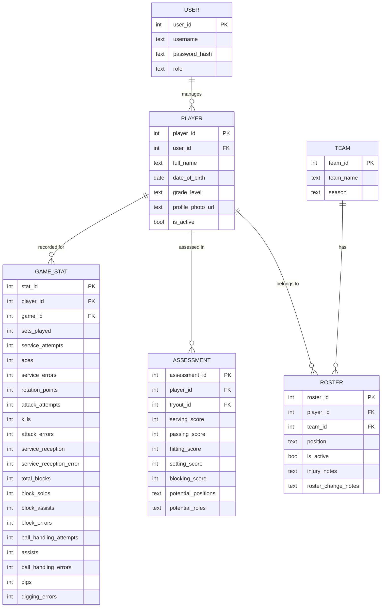

# Data Models and Schema

### Player Model

  * **Purpose**: Stores a player's core identity and profile information.
  * **Key Attributes**:
      * `player_id` (Primary Key, integer)
      * `user_id` (Foreign Key, integer): Links to the user account.
      * `full_name` (text)
      * `date_of_birth` (date)
      * `grade_level` (text)
      * `profile_photo_url` (text)
      * `is_active` (boolean)
  * **Relationships**: `one-to-one` with `User`, `one-to-many` with `Assessment`, `one-to-many` with `GameStat`.

### Assessment Model

  * **Purpose**: Stores a coach's assessment of a player's skills, particularly during tryouts.
  * **Key Attributes**:
      * `assessment_id` (Primary Key, integer)
      * `player_id` (Foreign Key, integer): Links to the player being assessed.
      * `tryout_id` (Foreign Key, integer): Links to the tryout event.
      * `serving_score` (integer)
      * `passing_score` (integer)
      * `hitting_score` (integer)
      * `setting_score` (integer)
      * `blocking_score` (integer)
      * `potential_positions` (text): e.g., 'Setter, Hitter'.
      * `potential_roles` (text): e.g., '5-1 Setter, 6-2 Hitter'.
  * **Relationships**: `many-to-one` with `Player`, `many-to-one` with `TryoutEvent`.

### Team Model

  * **Purpose**: Represents a team within an organization.
  * **Key Attributes**:
      * `team_id` (Primary Key, integer)
      * `organization_id` (Foreign Key, integer)
      * `team_name` (text)
      * `season` (text)
  * **Relationships**: `one-to-many` with `Roster`.

### Roster Model

  * **Purpose**: Manages the players on a specific team for a season.
  * **Key Attributes**:
      * `roster_id` (Primary Key, integer)
      * `player_id` (Foreign Key, integer)
      * `team_id` (Foreign Key, integer)
      * `position` (text)
      * `is_active` (boolean)
      * `injury_notes` (text)
      * `roster_change_notes` (text)
  * **Relationships**: `many-to-one` with `Player`, `many-to-one` with `Team`.

### GameStat Model

  * **Purpose**: Stores game-day statistics for a player.
  * **Key Attributes**:
      * `stat_id` (Primary Key, integer)
      * `player_id` (Foreign Key, integer)
      * `game_id` (Foreign Key, integer)
      * `sets_played` (integer)
      * `service_attempts` (integer)
      * `aces` (integer)
      * `service_errors` (integer)
      * `rotation_points` (integer)
      * `attack_attempts` (integer)
      * `kills` (integer)
      * `attack_errors` (integer)
      * `service_reception` (integer)
      * `service_reception_error` (integer)
      * `total_blocks` (integer)
      * `block_solos` (integer)
      * `block_assists` (integer)
      * `block_errors` (integer)
      * `ball_handling_attempts` (integer)
      * `assists` (integer)
      * `ball_handling_errors` (integer)
      * `digs` (integer)
      * `digging_errors` (integer)
  * **Relationships**: `many-to-one` with `Player`, `many-to-one` with `Game`.

### Entity-Relationship Diagram

-----
