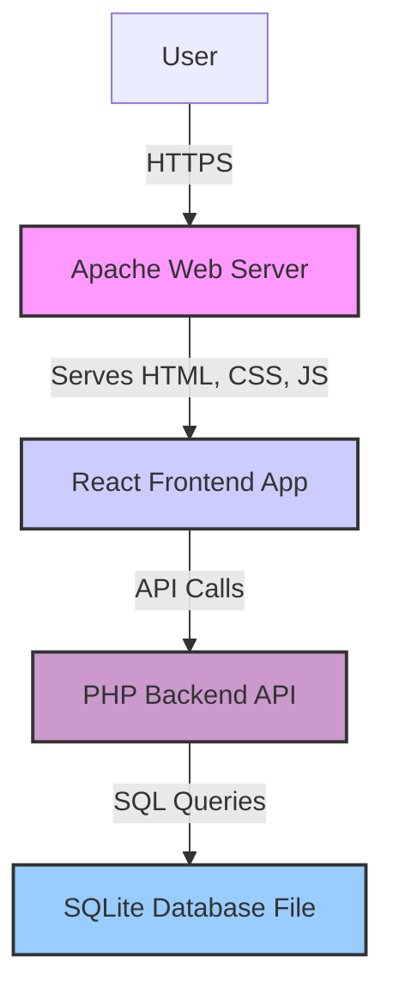

# High Level Architecture

### Technical Summary

The system will be built as a single, unified Monolith application, where the Apache web server serves a modern React frontend. The React application will communicate with a PHP API backend, which will handle business logic and interact with an SQLite database file. This architecture prioritizes a low-cost initial implementation while establishing a clear separation of concerns to enable future scaling and expansion.

### Architecture Diagram

-----
