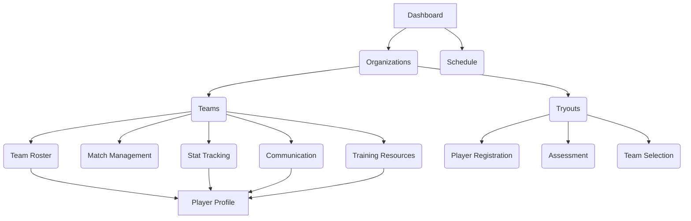

# Volleyball Coaching Application UI/UX Specification

## Introduction

This document defines the user experience goals, information architecture, user flows, and visual design specifications for the Volleyball Coaching Application's user interface. [cite\_start]It serves as the foundation for visual design and frontend development, ensuring a cohesive and user-centered experience[cite: 33, 36].

#### Overall UX Goals & Principles

  * **Target User Personas**:
      * **Coach**: The primary user who needs efficient and streamlined tools for team management.
      * **Player**: The secondary user who needs access to personal progress, team information, and developmental resources.
  * **Usability Goals**:
      * **Ease of learning**: The application should be intuitive enough for coaches transitioning from manual methods to quickly understand and use the core functionalities.
      * **Efficiency of use**: Experienced users should be able to complete frequent tasks (like entering stats or setting a lineup) with minimal friction.
      * **Clear and immediate feedback**: All user actions should have a clear, immediate response.
  * **Core Design Principles**:
      * [cite\_start]**Clarity over cleverness**: Prioritize clear communication and function over a purely aesthetic design[cite: 33, 36].
      * [cite\_start]**User-centric design**: Every design decision should be made to benefit the end user[cite: 33, 36].

## Information Architecture (IA)

#### Site Map / Screen Inventory

The navigation architecture is hierarchical, with Organizations as the top-level container for managing teams and tryouts.

#### Navigation Structure

  * **Primary Navigation**: A dashboard and a top-level schedule view provide quick access to a consolidated view of events across all associated teams and organizations.
  * **Hierarchical Navigation**: Teams and Tryouts are nested under a parent Organization container, creating a logical, tiered navigation experience.
  * **Contextual Navigation**: Screens for Roster, Match Management, Stat Tracking, Communication, and Training Resources are all accessible within the context of a specific team.

## User Flows

  * **Note**: Detailed user flows will be developed in a subsequent phase. However, the information architecture above provides the high-level flow for key user tasks such as tryout management and team selection.

## Wireframes & Mockups

  * **Note**: Detailed visual designs will be created in a design tool. However, the core screens and views listed in this document will serve as the foundation for the layouts.

## Component Library / Design System

  * **Design System Approach**: A component-based approach will be used to create a reusable library of React components. This will ensure a consistent user interface and accelerate development.
  * **Core Components**: Foundational components will include buttons, forms, tables, and data display elements to support the core functionalities outlined in the PRD.

## Branding & Style Guide

  * **Visual Identity**: A clean, modern, and sports-inspired aesthetic that conveys professionalism, efficiency, and a positive team spirit. Colors and typography will be easily readable and reflect dynamism.
  * [cite\_start]**Target Device and Platforms**: Web Responsive, optimized for desktop, tablet, and mobile browsers[cite: 33, 36].

## Accessibility Requirements

  * **Compliance Target**: **WCAG AA (Web Content Accessibility Guidelines Level AA)**. This ensures the application is usable by a wide range of people with disabilities.

## Responsiveness Strategy

  * **Adaptation Patterns**: The application will be designed with a web-responsive strategy to ensure it functions across various screen sizes. Layouts, navigation, and content priority will adapt to provide an optimal user experience on desktop, tablet, and mobile devices.

## Performance Considerations

  * **Performance Goals**: The user interface should load quickly and provide a smooth, responsive experience for all user interactions.

## Next Steps

After completing the UI/UX specification, the next steps are as follows:

1.  **Architect Handoff**: This document is the primary input for the Architect to create the `front-end-architecture.md`, detailing the component architecture, state management, and routing.
2.  **Product Owner Validation**: The Product Owner will validate this document against the PRD and the final architecture to ensure consistency before development begins.
3.  **Visual Design**: Visual mockups and wireframes will be created in a design tool.