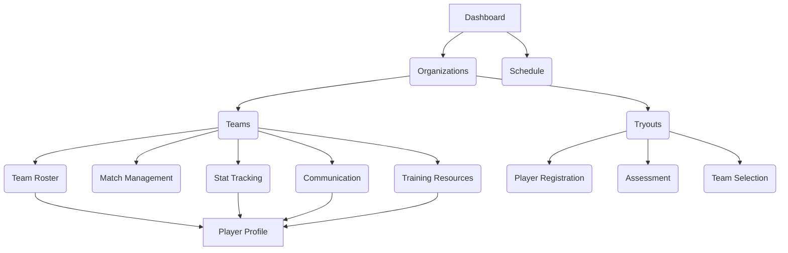

# Information Architecture (IA)

### Site Map / Screen Inventory

The navigation architecture is hierarchical, with Organizations as the top-level container for managing teams and tryouts.

### Navigation Structure

  * **Primary Navigation**: A dashboard and a top-level schedule view provide quick access to a consolidated view of events across all associated teams and organizations.
  * **Hierarchical Navigation**: Teams and Tryouts are nested under a parent Organization container, creating a logical, tiered navigation experience.
  * **Contextual Navigation**: Screens for Roster, Match Management, Stat Tracking, Communication, and Training Resources are all accessible within the context of a specific team.
